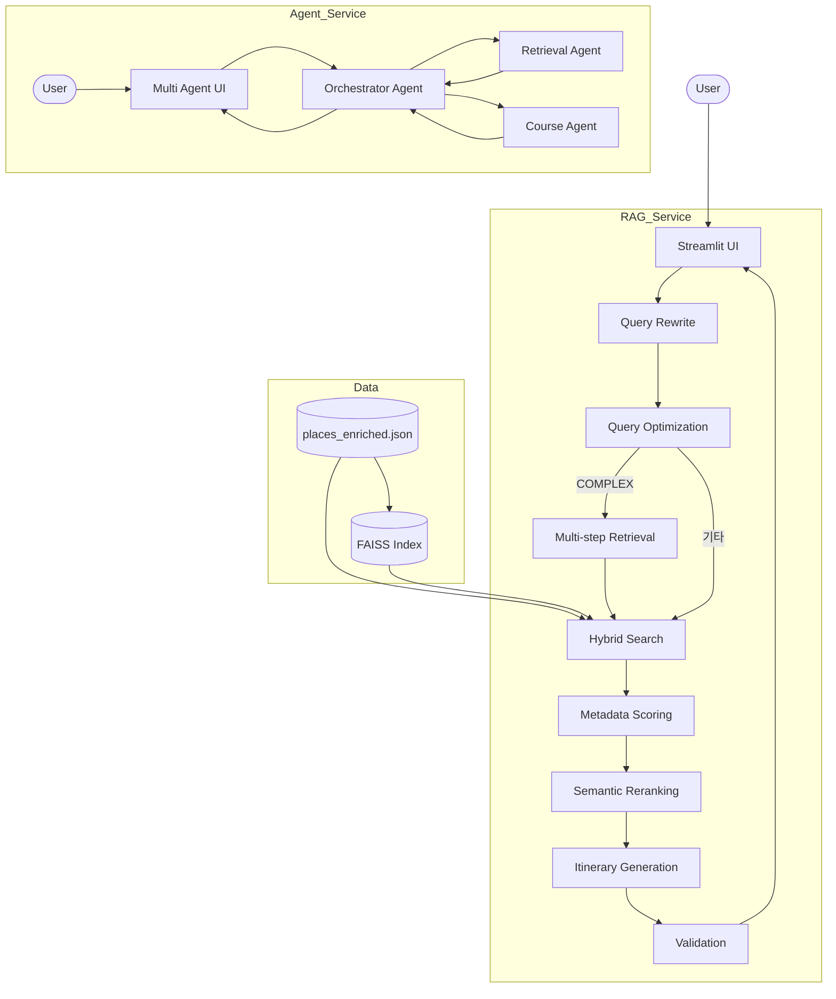
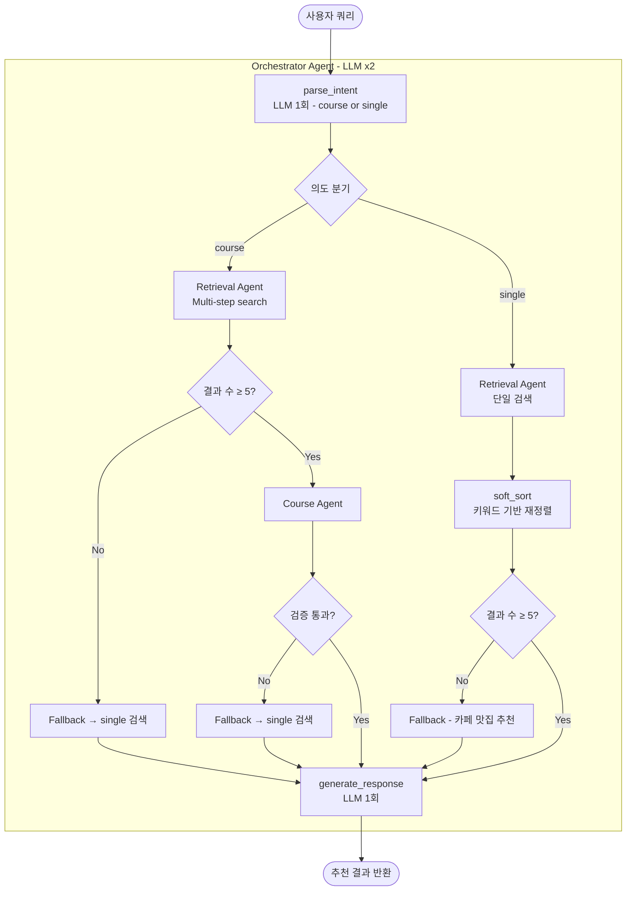

# 여행 일정 자동 추천 서비스

> **RAG 기반 장소 검색 → Multi Agent 추천**까지,  
> 문제 정의부터 설계 결정까지 단계적으로 발전시킨 AI 추천 시스템

---

## 목차

1. [서비스 목적 및 문제 정의](#1-서비스-목적-및-문제-정의)
2. [해결 방향](#2-해결-방향)
3. [트레이드오프 및 설계 결정](#3-트레이드오프-및-설계-결정)
4. [시스템 아키텍처](#4-시스템-아키텍처)
5. [에이전트 파이프라인](#5-에이전트-파이프라인)
6. [프로젝트 진화 경로](#6-프로젝트-진화-경로)
7. [기술 스택](#7-기술-스택)
8. [실행 방법](#8-실행-방법)
9. [배포](#9-배포)

---

## 1. 서비스 목적 및 문제 정의

### 기존 방식의 한계

여행지 추천 서비스는 크게 두 가지 방식으로 구현된다.

**규칙 기반 필터링**은 지역·카테고리 조건으로 목록을 반환하지만, "비 오는 날 조용하게 데이트하고 싶다"처럼 복합적인 사용자 의도를 반영하지 못한다.

**LLM 직접 생성**은 유창한 문장을 만들지만, 실존하지 않는 장소·폐업한 가게·부정확한 주소를 포함하는 **Hallucination** 문제가 구조적으로 내재되어 있다.

### 핵심 문제 3가지

| 문제 | 증상 |
|------|------|
| **의도 미반영** | "쉬고 싶어"를 카페·공원과 연결하지 못함 |
| **단일 검색 편향** | "카페도 가고 밥도 먹고 싶어" → 카페만 나옴 |
| **Hallucination** | LLM이 없는 장소를 생성해 신뢰도 훼손 |

---

## 2. 해결 방향

### RAG 구조 도입

검색된 실제 장소 데이터만을 LLM 컨텍스트로 제공함으로써 Hallucination을 **구조적으로** 차단했다. LLM은 생성이 아닌 **추천 설명 작성**에만 사용된다.

### Hybrid Search 선택

FAISS(의미 검색)만 사용하면 "카페"처럼 명확한 키워드 쿼리에서 카테고리 매칭이 약하다. BM25(키워드 검색)만 사용하면 "조용하게 쉴 수 있는 곳" 같은 의미 쿼리가 동작하지 않는다.

두 방식을 결합해 **쿼리 타입에 따라 가중치를 동적으로 조정**하는 Hybrid Search를 설계했다.

### Multi-step Retrieval 설계

복합 요청("카페 → 식사 → 산책 코스")을 단일 쿼리로 검색하면 하나의 카테고리에 결과가 편향된다. 쿼리를 카테고리별 하위 쿼리로 분해하고 독립 검색 후 병합하는 방식으로 이 문제를 해결했다.

### Agent 구조 도입

검색 로직이 복잡해질수록 단일 스크립트의 유지보수성이 낮아졌다. **의도 파악 → 검색 → 코스 조합 → 응답 생성**의 각 단계를 독립 Agent로 분리해 역할 경계를 명확히 했다.

---

## 3. 트레이드오프 및 설계 결정

### FAISS vs BM25 → Hybrid 선택

| 방식 | 강점 | 약점 |
|------|------|------|
| FAISS | 의미·문맥 검색 | 정확한 키워드 매칭 약함 |
| BM25 | 키워드 정확 매칭 | 의미·성향 쿼리 처리 약함 |
| **Hybrid** | 두 방식 결합 | weight 튜닝 필요 |

쿼리 타입을 `KEYWORD / SEMANTIC / MIXED / COMPLEX` 4종으로 분류하고 타입별로 weight를 자동 결정해 추가 LLM 호출 없이 효율을 확보했다.

### Rule-based vs LLM Agent → Hybrid 선택

의도 파악(intent parsing)과 응답 생성(response generation)은 LLM이 담당하고, 검색(Retrieval)과 코스 조합(Course building)은 순수 Python 로직으로 구현했다.

LLM을 모든 단계에 사용하면 비용과 지연이 증가하고, 완전 rule-based는 자연어 의도를 해석하지 못한다. **LLM 호출을 2회로 제한**하고 나머지는 결정론적 로직으로 처리했다.

### filtering vs soft_sort 선택

지역 외 장소가 검색 결과에 포함될 때 완전 필터링을 적용하면 결과 수가 줄어 다양성이 손실된다. 대신 **soft_sort** 방식을 채택해 결과를 제거하지 않고 관련도 높은 항목을 상위로 재정렬했다.

### 성능 vs 유연성

Semantic Reranking(LLM 재정렬)은 정확도를 높이지만 추가 API 호출 비용이 발생한다. MD5 캐싱으로 동일 입력의 재호출을 방지했고, Multi Agent 구조에서는 Reranking 없이 BM25 hybrid + soft_sort만으로 응답 품질을 유지했다.

---

## 4. 시스템 아키텍처



### 계층 구조

| Layer | 역할 | 구성 요소 |
|-------|------|---------|
| **UI Layer** | 사용자 입력 수신 및 결과 출력 | Streamlit (`app.py`) |
| **Agent Layer** | 의도 분석, 흐름 제어, 응답 생성 | Orchestrator Agent |
| **Retrieval Layer** | 하이브리드 장소 검색 실행 | Retrieval Agent, FAISS, BM25 |
| **Course Layer** | 카테고리 기반 코스 조합 및 검증 | Course Agent |
| **RAG Pipeline** | 쿼리 최적화, 재정렬, 일정 생성 | Query Rewrite, Hybrid Search, Reranker |
| **Data Layer** | 장소 데이터 및 벡터 인덱스 저장 | `places_enriched.json`, FAISS Index |

### 데이터 파이프라인

장소 데이터는 단순 CSV가 아닌 **Contextual Embedding** 전략으로 구조화된다.

```
[힐링형, 감성형] 성향 여행자가 노원구에서 방문할 수 있는 카페.
장소명: ○○카페
키워드: 카페 감성 여유 조용
설명: 조용한 분위기의 소규모 감성 카페
plain_text: 힐링 데이트 혼자 여유 실내 맑음
```

성향·지역·목적을 앞에 배치해 임베딩 모델이 "누구를 위해, 어디에, 어떤 목적"인지를 벡터에 반영하게 했다.

---

## 5. 에이전트 파이프라인



### Agent 역할 분리 원칙

| Agent | 역할 | LLM 사용 |
|-------|------|----------|
| **Orchestrator** | 의도 파악, 흐름 제어, 응답 생성 | ✅ 2회 |
| **Retrieval** | RAG 기반 장소 검색 | ❌ |
| **Course** | 카테고리 기반 코스 조합 및 검증 | ❌ |

LLM 호출을 Orchestrator의 2회로 제한함으로써 비용과 지연을 제어하면서 자연어 처리 능력을 유지했다.

### Fallback 전략

```
검색 결과 < 5개  →  단일 추천 fallback
코스 조합 실패   →  단일 추천 fallback  
검증 실패        →  단일 추천 fallback
```

3단계 fallback을 통해 어떤 엣지 케이스에서도 응답이 반환되도록 설계했다. trace 리스트에 각 단계의 실행 경로가 기록되어 디버깅과 모니터링이 가능하다.

---

## 6. 프로젝트 진화 경로

```mermaid
graph LR
    A[기본 RAG<br/>FAISS 단일 검색] --> B[Contextual Embedding<br/>구조화된 page_content]
    B --> C[Hybrid Search<br/>FAISS + BM25]
    C --> D[Query Rewrite<br/>자연어 → 검색 최적화]
    D --> E[Query Optimization<br/>쿼리 타입 자동 분류]
    E --> F[Multi-step Retrieval<br/>복합 쿼리 분해]
    F --> G[Semantic Reranking<br/>LLM 재정렬]
    G --> H[Single Agent<br/>통합 제어]
    H --> I[Multi Agent<br/>역할 분리]

    style A fill:#e8f4fd
    style C fill:#d4edda
    style G fill:#fff3cd
    style I fill:#f8d7da
```



### 단계별 문제와 해결

**기본 RAG → Contextual Embedding**  
단순 텍스트 concat 임베딩은 "힐링형 여행자에게 맞는 장소"를 벡터에 반영하지 못했다. page_content를 성향·지역·카테고리를 포함한 구조화된 자연어로 재구성했다.

**Hybrid Search 도입**  
FAISS 단독 사용 시 "카페" 같은 키워드형 쿼리에서 카테고리 매칭이 불안정했다. BM25를 추가해 키워드 정확도를 확보하고, 쿼리 타입별 weight 조정으로 두 방식의 장점을 선택적으로 활용했다.

**고도화 과정에서 발견·수정된 문제들**

| 문제 | 원인 | 해결 |
|------|------|------|
| 카페 결과 쏠림 | 카페 page_content 중복 패턴 | 카테고리별 최대 3개 다양성 제한 |
| 활동 쿼리 완전 실패 | `activity` 토큰 BM25 미포함 | `plain_text`에 활동 어휘 명시적 추가 |
| is_general 97% | 판별 기준 과도하게 넓음 | 조건 세분화로 비율 정상화 |
| 가족 purpose 부족 | 가족 관련 키워드 매핑 누락 | persona 키워드 확장 |

**Single Agent → Multi Agent**  
검색·코스 조합·응답 생성이 하나의 스크립트에 뒤섞이면서 유지보수가 어려워졌다. Orchestrator / Retrieval / Course Agent로 역할을 분리해 각 Agent가 단일 책임을 갖도록 구조화했다. 이 과정에서 검증 로직(validate_course)과 trace 기반 실행 추적이 추가됐다.

---

## 7. 기술 스택

| 영역 | 기술 | 선택 이유 |
|------|------|---------|
| **Frontend** | Streamlit | 빠른 프로토타이핑, Python 네이티브 UI |
| **Backend** | Python 3.11+ | Agent 및 RAG 파이프라인 전체 구현 |
| **LLM** | OpenAI GPT-4o-mini | 의도 파악·응답 생성 2회 호출로 비용 제어 |
| **LLM Framework** | LangChain | 프롬프트 관리, LLM 체이닝, 출력 파싱 |
| **Embedding** | OpenAI text-embedding-ada-002 | 장소 의미 벡터화, Contextual Embedding 적용 |
| **Vector DB** | FAISS (faiss-cpu) | 인메모리 Dense 유사도 검색, 별도 서버 불필요 |
| **Sparse Search** | BM25 (rank-bm25) | 카테고리·키워드 정확 매칭 보완 |
| **Hybrid Search** | FAISS + BM25 | 쿼리 타입(`KEYWORD/SEMANTIC/MIXED/COMPLEX`)별 가중치 동적 조정 |
| **Data** | JSON (`places_enriched.json`) | Contextual Embedding용 구조화 장소 데이터 |

---

## 8. 실행 방법

### 설치

```bash
git clone <repository-url>
cd 05_travel_plan_service
pip install -r requirements.txt
```

### API 키 설정

`.streamlit/secrets.toml` 파일 생성:

```toml
OPENAI_API_KEY = "sk-..."
```

또는 환경 변수로 설정:

```bash
export OPENAI_API_KEY="sk-..."
```

### 실행

> **실행 위치:** 모든 명령은 `05_travel_plan_service/` 디렉토리에서 실행해야 한다.  
> 각 파일이 `__file__` 기준 절대 경로로 의존성을 해석하므로, 어느 경로에서 실행해도 동작하지만  
> 아래 명령은 해당 디렉토리를 현재 경로로 가정한다.

**여행 일정 추천 서비스 (메인)**

```bash
streamlit run app.py
```

**Multi Agent 추천 서비스**

```bash
streamlit run agents/multi_agent/app.py
```

**Agent 테스트**

```bash
# Multi Agent 종합 검증 (8 시나리오)
python -X utf8 agents/multi_agent/test_final.py

# Single Agent CLI
python agents/single_agent/agent.py "노원 데이트 코스 추천해줘"
```

---

## 9. 배포

### 컨테이너 구성

`Dockerfile` + `docker-compose.yml`로 실행 환경을 표준화했다. Streamlit 앱과 FastAPI 인증 서버를 독립 컨테이너로 분리하고, `depends_on`으로 시작 순서를 보장한다.

| 컨테이너 | 역할 | 포트 |
|---------|------|------|
| `travel-service` | Streamlit 앱 | 8501 |
| `auth-service` | FastAPI 인증 서버 | 8000 |

### 보안 설계

API Key를 이미지 레이어에 포함하지 않기 위해 `docker-entrypoint.sh`를 사용했다. 컨테이너 시작 시 환경변수(`OPENAI_API_KEY`)로부터 `.streamlit/secrets.toml`을 동적으로 생성하고, `.dockerignore`로 실제 키 파일이 이미지에 복사되지 않도록 차단했다.

### 클라우드 배포

| 플랫폼 | 배포 방식 |
|--------|---------|
| Render | GitHub 연동 → Dockerfile 자동 감지 → 환경변수 설정 |
| Railway | GitHub 연동 → Dockerfile 자동 감지 → Generate Domain |

공통 절차: GitHub 리포지토리 연결 → Docker 빌드 방식 선택 → `OPENAI_API_KEY` 환경변수 설정 → 배포.
